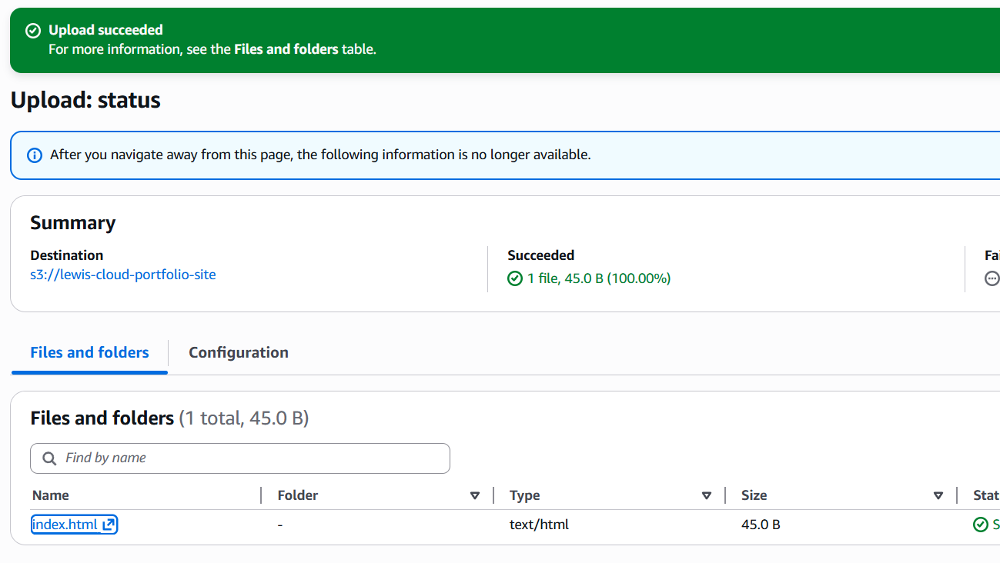
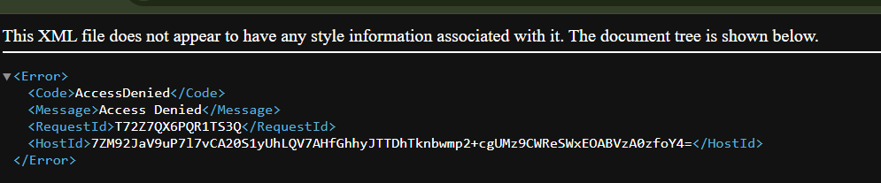

# Component 1 — Private Amazon S3 Bucket

## Objective

The first stage of this project was to create a secure Amazon S3 bucket to store the static website files.

Rather than exposing the bucket directly to the internet, it was intentionally configured as **private** from the outset. This provides a secure foundation for the architecture, where CloudFront (configured in the next component) will become the only service permitted to retrieve objects from the bucket.

---

# AWS Service

- Amazon S3 (Simple Storage Service)

---

# What Was Created

An Amazon S3 bucket named:

```
lewis-cloud-portfolio-site
```

The bucket was configured with the following settings:

- **ACLs Disabled (Bucket Owner Enforced)**
- **Block Public Access enabled** (all four settings left enabled)
- **Bucket Versioning enabled**
- **Default Server-Side Encryption (SSE-S3)**

These settings ensure the bucket remains private while providing version recovery and encryption for all stored objects.

---

# Why Amazon S3?

This project hosts a static website consisting of:

- HTML
- CSS
- JavaScript
- Images

Since every visitor receives the same files, no server-side processing or compute is required.

Amazon S3 is designed specifically for storing and serving static content, making it a far simpler and more cost-effective solution than running a web server on EC2.

Using EC2 would require:

- Managing an operating system
- Installing and maintaining a web server (e.g. Nginx)
- Applying security updates
- Scaling for traffic
- Paying for compute even when the website receives no visitors

S3 removes all of this operational overhead by simply storing and returning files.

---

# Configuration

| Setting | Value |
|----------|-------|
| Bucket Name | `lewis-cloud-portfolio-site` |
| Object Ownership | Bucket Owner Enforced |
| ACLs | Disabled |
| Block Public Access | Enabled |
| Versioning | Enabled |
| Default Encryption | SSE-S3 |

---

# Security Considerations

One of the most important design decisions was keeping **Block Public Access fully enabled**.

Many introductory tutorials recommend disabling this setting to make a bucket publicly accessible for static website hosting. Instead, this project follows AWS security best practices by keeping the bucket private at all times.

In the next stage, CloudFront will be configured with **Origin Access Control (OAC)**.

It's important to understand that these are **two separate security controls**:

- **Origin Access Control (OAC)** authorises CloudFront to retrieve objects from the bucket through a resource-based bucket policy.
- **Block Public Access** prevents accidental public exposure of the bucket, even if an overly permissive bucket policy is applied in the future.

Using both together provides **defence in depth**, ensuring multiple independent controls protect the bucket.

---

# Versioning

Bucket Versioning was enabled during creation.

This allows previous versions of objects to be recovered if files are accidentally overwritten or deleted.

For example, if a future deployment replaced `index.html` with a broken version, the previous version could be restored without rebuilding the application.

---

# Encryption

Amazon S3 Server-Side Encryption (SSE-S3) was left enabled.

As this is enabled by default for new buckets, no additional configuration was required.

This ensures that every object stored within the bucket is encrypted while at rest.

---

# Verification

To confirm the bucket was correctly configured as private:

1. A simple `index.html` file was created.
2. The file was uploaded to the S3 bucket.
3. The object's S3 URL was opened directly in a web browser.

The browser returned an XML **AccessDenied** response.

This confirmed that:

- the object existed within the bucket
- the upload was successful
- the bucket was not publicly accessible
- direct internet access to S3 objects was correctly blocked

This is the expected behaviour before CloudFront is configured.

---

# Screenshots

## Uploaded Test HTML File

The `index.html` file was successfully uploaded to the private S3 bucket.



---

## Direct S3 Object Access

Attempting to access the uploaded object directly through its S3 URL returned an **AccessDenied** XML response.

This verified that the bucket remained private and could not be accessed directly from the public internet.



# Lessons Learned

During this component I learned:

- Amazon S3 is object storage rather than a traditional file system.
- Buckets act as logical containers that store objects.
- Each object consists of a key, value and metadata.
- Static websites do not require compute resources such as EC2.
- Block Public Access and Origin Access Control are separate security mechanisms.
- Versioning allows previous object versions to be restored after accidental deployments.
- Keeping S3 private and exposing it through CloudFront is more secure than making the bucket publicly accessible.
