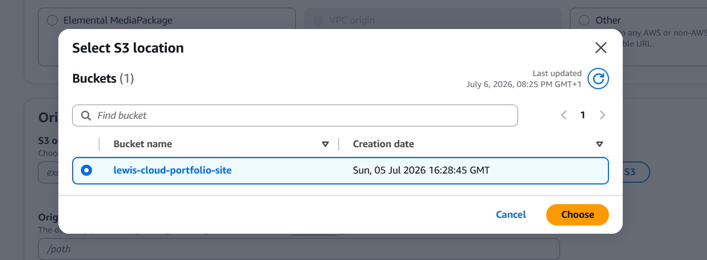
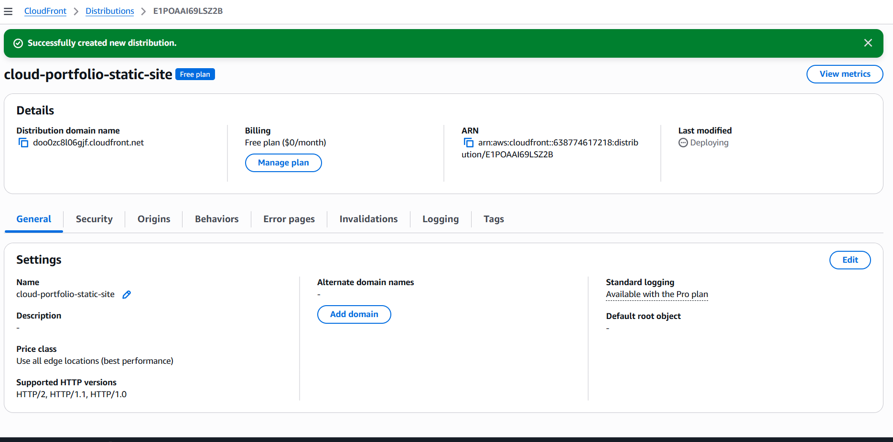
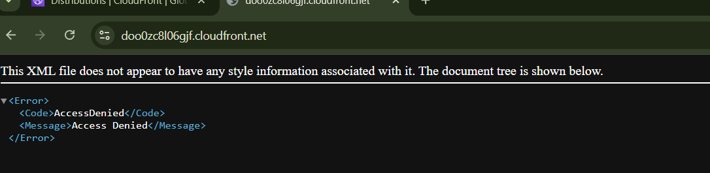
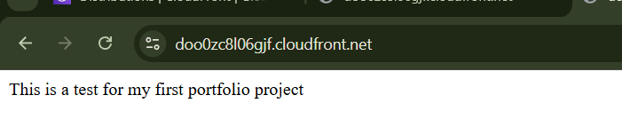

# Component 2 — CloudFront Distribution with Origin Access Control

## Objective

The second stage of this project was to create an Amazon CloudFront distribution that securely retrieves the static website files from the private S3 bucket and serves them publicly over HTTPS.

The S3 bucket remains inaccessible directly from the internet. CloudFront becomes the only public entry point for the website.

---

# AWS Services

- Amazon CloudFront
- Amazon S3
- AWS Identity and Access Management
- Origin Access Control

---

# What Was Created

A CloudFront distribution named:

```text
cloud-portfolio-static-site
```

The following main settings were configured:

- Origin type: Amazon S3
- Origin bucket: `lewis-cloud-portfolio-site`
- Origin access: Origin Access Control
- Request signing: AWS Signature Version 4
- Viewer protocol policy: Redirect HTTP to HTTPS
- Allowed methods: GET and HEAD
- Default root object: `index.html`

---

# Why CloudFront Was Used

The S3 bucket was intentionally kept private during Component 1.

CloudFront provides a secure way to expose the website publicly without making the bucket itself public.

CloudFront also provides:

- HTTPS support
- Edge caching
- Faster delivery through global edge locations
- Reduced traffic sent directly to S3
- A future integration point for AWS WAF
- Support for a custom domain and ACM certificate
- A single controlled entry point for static website traffic

Without CloudFront, the alternative would be to make the S3 bucket publicly readable, which would weaken the security design.

---

# Selecting the S3 Origin

During distribution creation:

1. Amazon S3 was selected as the origin type.
2. The private bucket `lewis-cloud-portfolio-site` was selected as the origin.
3. Origin Access Control was used so CloudFront could authenticate its requests to S3.
4. The S3 bucket policy was updated to trust the specific CloudFront distribution.

The selected S3 bucket acts as the origin from which CloudFront retrieves `index.html` and any future static assets.

---

# Origin Access Control

Origin Access Control allows CloudFront to send signed requests to the private S3 bucket.

OAC itself does not automatically grant access to S3. Two parts are required:

1. CloudFront must be configured to sign origin requests using OAC.
2. The S3 bucket policy must explicitly allow the CloudFront service to read objects.

The bucket policy should also restrict access to the specific CloudFront distribution by using its ARN in an `AWS:SourceArn` condition.

This prevents another CloudFront distribution from attempting to use the same bucket as an origin.

The trust relationship can be summarised as:

```text
CloudFront OAC
      │
      │ Signs request
      ▼
Private S3 Bucket
      │
      │ Bucket policy checks distribution ARN
      ▼
Request allowed or denied
```

---

# Block Public Access and OAC

Block Public Access remained enabled on the S3 bucket.

Block Public Access and OAC are separate security controls:

- OAC grants the trusted CloudFront distribution access to S3.
- Block Public Access prevents the bucket from accidentally becoming publicly accessible.

Using both provides defence in depth.

Even if the bucket policy were accidentally made too broad later, Block Public Access would provide an additional safeguard against public exposure.

---

# Default Root Object Issue

After the distribution was created, opening the CloudFront domain initially returned an XML `AccessDenied` error.

The distribution and S3 origin existed, but the CloudFront **Default root object** had not been configured.

When a user requested the root CloudFront address:

```text
https://example.cloudfront.net/
```

CloudFront did not automatically know that it should request:

```text
index.html
```

Because no object was specified for the `/` path, CloudFront could not return the website homepage.

The issue was resolved by setting:

```text
Default root object: index.html
```

After the distribution redeployed, visiting the same CloudFront domain successfully loaded the test page.

---

# Request Flow

```text
User Browser
     │
     │ HTTPS request
     ▼
Amazon CloudFront
     │
     │ Signed request using OAC
     ▼
Private S3 Bucket
     │
     │ Returns index.html
     ▼
Amazon CloudFront
     │
     │ Caches and returns content
     ▼
User Browser
```

The browser never communicates directly with S3.

CloudFront retrieves the object on the user's behalf and returns it over HTTPS.

---

# Verification

The CloudFront distribution was verified in two stages.

## Initial Test

The CloudFront domain initially returned:

```text
AccessDenied
```

This occurred because the Default root object had not been configured.

The browser successfully reached CloudFront, but CloudFront did not know which object to request for the `/` path.

## Successful Test

After setting the Default root object to `index.html`, the CloudFront distribution redeployed.

Opening the CloudFront domain then displayed:

```text
This is a test for my first portfolio project
```

This confirmed that:

- CloudFront was publicly reachable
- CloudFront could access the private S3 bucket
- OAC and the bucket policy were working together
- `index.html` was being retrieved successfully
- The S3 bucket remained private
- Static content was being served through CloudFront over HTTPS

---

# Screenshots

## Selecting the Private S3 Origin

The private S3 bucket `lewis-cloud-portfolio-site` was selected as the origin for the CloudFront distribution.



---

## CloudFront Distribution Created

The CloudFront distribution `cloud-portfolio-static-site` was successfully created and assigned a public CloudFront domain.

At this point, the distribution was still deploying and the Default root object had not yet been configured.



---

## Initial CloudFront Access Denied Error

Opening the CloudFront domain initially returned an `AccessDenied` XML response because the Default root object had not been set.

CloudFront therefore did not know that a request to `/` should return `index.html`.



---

## CloudFront Website Working

After setting the Default root object to `index.html` and allowing the distribution to redeploy, the CloudFront domain successfully displayed the test page.



---

# Problem Encountered

## Missing Default Root Object

### Problem

Opening the CloudFront domain returned an XML `AccessDenied` response.

### Cause

The Default root object field was blank.

A request to the CloudFront root path `/` did not automatically map to `index.html`.

### Resolution

The CloudFront distribution settings were updated to include:

```text
index.html
```

as the Default root object.

The distribution was then allowed time to redeploy.

### Result

The CloudFront domain successfully displayed the website.

---

# Security Considerations

The following security controls were used:

- The S3 bucket remained private.
- S3 Block Public Access remained enabled.
- CloudFront used Origin Access Control.
- Origin requests were signed using SigV4.
- The bucket policy trusted the specific CloudFront distribution.
- HTTP requests were redirected to HTTPS.
- Only GET and HEAD methods were allowed.
- Users could not bypass CloudFront and access S3 directly.

---

# Key Design Decisions

| Decision | Reason |
|---|---|
| CloudFront instead of public S3 hosting | Keeps the bucket private while still serving the website publicly |
| OAC instead of public bucket access | Allows authenticated access from CloudFront only |
| OAC instead of legacy OAI | OAC is the modern AWS-recommended approach |
| HTTP redirected to HTTPS | Ensures encrypted communication |
| GET and HEAD only | The origin only needs to serve static files |
| Default root object set to `index.html` | Allows the root CloudFront URL to load the homepage |
| Bucket policy scoped to the distribution ARN | Prevents unrelated CloudFront distributions from accessing the bucket |

---

# Lessons Learned

During this component I learned:

- CloudFront acts as the public entry point for the private S3 bucket.
- OAC signs CloudFront requests to S3.
- The S3 bucket policy must separately grant CloudFront access.
- OAC and the bucket policy are two halves of the same trust relationship.
- Block Public Access and OAC are independent security controls.
- A CloudFront distribution can deploy successfully while still being incorrectly configured.
- The Default root object is required for requests made to the root `/` path.
- An `AccessDenied` error can occur at different stages depending on whether the issue is with S3 permissions or CloudFront path configuration.
- CloudFront caches content at edge locations rather than retrieving every request from S3.

---
