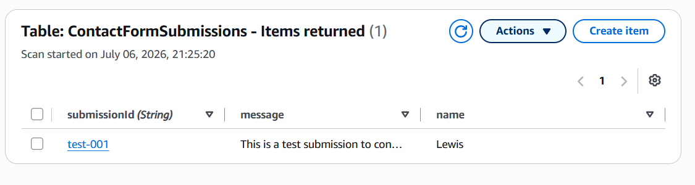

# Component 3 — Amazon DynamoDB Table

## Objective

The third component of this project was to create a DynamoDB table to persist contact form submissions.

Rather than storing submissions locally or within the Lambda function itself, DynamoDB provides a fully managed, serverless NoSQL database that automatically scales to handle unpredictable workloads.

---

# AWS Services Used

- Amazon DynamoDB

---

# What Was Created

A DynamoDB table named:

```text
ContactFormSubmissions
```

The table was configured with:

- Partition Key: `submissionId`
- Data Type: String
- No Sort Key
- Capacity Mode: On-demand
- Default encryption enabled
- Deletion protection disabled

---

# Why DynamoDB?

The contact form requires a persistent storage layer where every submission can be saved independently of the compute layer.

DynamoDB was chosen because:

- It is fully managed.
- It automatically scales.
- No servers require provisioning or maintenance.
- It integrates directly with AWS Lambda.
- Pricing matches unpredictable workloads.

The Lambda function will eventually write each contact form submission directly into this table.

---

# Table Design

The table contains a single partition key:

```text
submissionId
```

Every contact form submission will generate a brand new UUID inside the Lambda function before being written to DynamoDB.

Example item:

```text
submissionId
name
email
message
```

Each submission becomes an independent item.

---

# Why a UUID Partition Key?

Choosing a UUID is about far more than simply making each submission unique.

## Preventing Data Loss

If email were used as the partition key, multiple submissions from the same person would overwrite one another.

For example:

```text
email = lewis@example.com
```

Submitting the form twice would cause the second `PutItem` request to replace the first item rather than creating a second submission.

Using a UUID guarantees that every submission receives its own unique key, preventing accidental data loss.

---

## Even Write Distribution

Using timestamps as partition keys may appear sensible but introduces another problem.

If many users submit the form around the same time, their keys become closely related, creating "hot partitions".

Hot partitions concentrate write traffic onto a small number of DynamoDB partitions, increasing the likelihood of throttling under heavy load.

A randomly generated UUID distributes writes evenly across DynamoDB's underlying partitions, allowing the service to scale efficiently regardless of submission volume.

For this reason, the partition key was chosen based on:

- uniqueness
- write distribution
- scalability

rather than convenience.

---

# Capacity Mode

The table was left using:

```text
On-demand
```

This was chosen because contact form traffic is expected to be:

- unpredictable
- low volume
- bursty

Provisioned capacity would require paying for reserved throughput even when no submissions are being received.

On-demand capacity automatically scales up and down based on demand, making it a more appropriate and cost-effective choice for this workload.

---

# Verification

Before any Lambda code was written, the table itself was verified independently.

A test item was manually created through the DynamoDB console using **Create item**.

The item successfully appeared under **Explore table items**, confirming:

- the table was created correctly
- the partition key was functioning
- items could be written successfully
- the table was ready for Lambda integration

---

# Screenshots

## Test Item Successfully Added

A manual test item was inserted into the DynamoDB table to verify that items could be stored correctly before integrating Lambda.



---

# Security Considerations

The following design decisions were made:

- Default encryption remained enabled.
- The table remained accessible only through IAM permissions.
- No public access exists for DynamoDB.
- Lambda will later receive permission to perform only:

```text
dynamodb:PutItem
```

against this specific table.

---

# Key Design Decisions

| Decision | Reason |
|----------|--------|
| UUID partition key | Prevents overwriting submissions and distributes writes evenly |
| On-demand capacity | Better suited for unpredictable, low-volume traffic |
| No sort key | Each submission is independent and does not require ordering |
| Default encryption | Protects data stored at rest |
| Manual verification before Lambda | Confirms the database works independently before introducing compute |

---

# Lessons Learned

During this component I learned:

- DynamoDB is a serverless NoSQL database.
- Every item requires a unique partition key.
- `PutItem` replaces existing items with the same partition key.
- UUIDs prevent accidental overwrites.
- UUIDs also improve write distribution across partitions.
- On-demand capacity is ideal for unpredictable workloads.
- DynamoDB statistics such as Item Count are eventually consistent and should not be relied upon for immediate verification.
- **Explore table items** is the correct place to verify newly created items.

---
