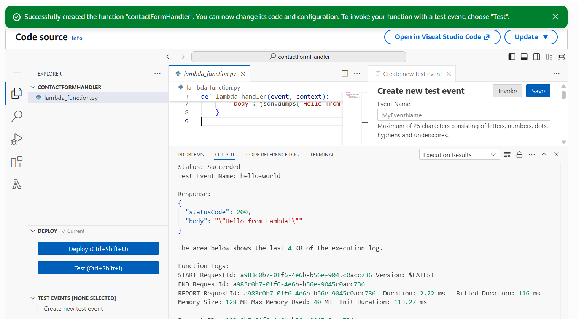
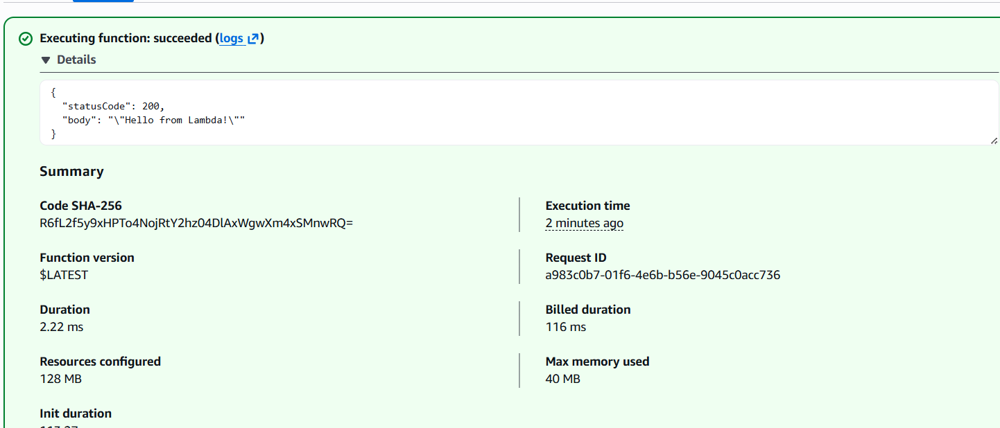
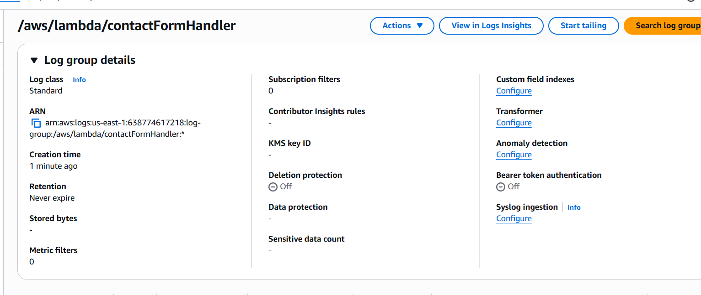
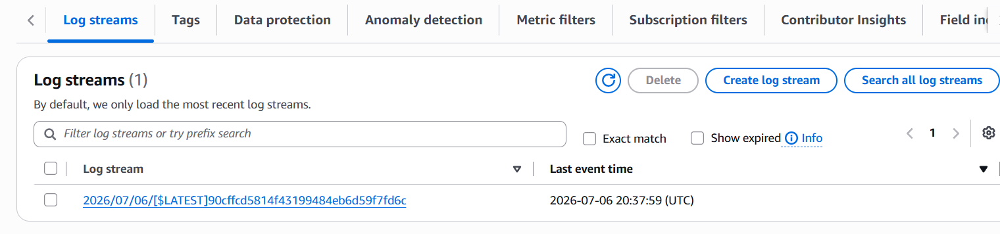

# Component 4 — AWS Lambda Function

## Objective

The fourth component of this project was to create the application's Lambda function.

At this stage, no business logic was implemented. Instead, the objective was to create the function with the minimum permissions required, verify that it could execute successfully, and confirm that it was capable of writing logs to CloudWatch before granting access to any other AWS services.

This follows the principle of least privilege by proving the function works before expanding its permissions.

---

# AWS Services Used

- AWS Lambda
- AWS Identity and Access Management (IAM)
- Amazon CloudWatch Logs

---

# What Was Created

A Lambda function named:

```text
contactFormHandler
```

The function was configured with:

- Runtime: Python 3.14
- Architecture: arm64 (AWS Graviton)
- Execution role: Basic Lambda execution role
- Automatic CloudWatch log group creation

Initially the execution role only contained permissions to:

```text
logs:CreateLogGroup
logs:CreateLogStream
logs:PutLogEvents
```

No DynamoDB or Amazon SES permissions were granted during this stage.

---

# Why Lambda?

AWS Lambda was chosen because it provides a fully managed serverless compute service.

Rather than managing virtual machines or web servers, Lambda executes code only when invoked.

For this project, Lambda will eventually become the application layer between:

```text
API Gateway
        ↓
Lambda
        ↓
DynamoDB
```

Creating the function before writing any business logic allows each stage of the architecture to be verified independently.

---

# Why Start with a Minimal IAM Role?

Instead of granting broad permissions immediately, the function was deliberately created using only the automatically generated execution role.

This demonstrates the principle of least privilege.

At this stage the function only needed permission to:

- execute successfully
- create CloudWatch log groups
- create log streams
- write execution logs

Only after verifying these capabilities would permissions be expanded to access DynamoDB and Amazon SES.

Building the project this way makes every permission added later an intentional design decision rather than a default configuration.

---

# Runtime Selection

Python 3.14 was selected because it is the language I am most familiar with, having used Python extensively throughout my university dissertation.

Using a familiar runtime allows greater focus on AWS architecture rather than language syntax.

---

# Architecture Selection

The Lambda function was deployed using:

```text
arm64 (AWS Graviton)
```

rather than:

```text
x86_64
```

This architecture was selected because AWS Graviton functions are typically around 20% cheaper per invocation while providing equivalent performance for typical Python workloads.

Since this project performs lightweight request processing, there is no practical downside to using arm64.

---

# Verification

Before writing any application logic, the Lambda function itself was verified.

A default test event was executed from within the Lambda console.

The function returned a successful response containing:

```json
{
  "statusCode": 200,
  "body": "\"Hello from Lambda!\""
}
```

This confirmed:

- the function had deployed successfully
- the runtime was functioning correctly
- the execution role was valid
- Lambda could execute code successfully

---

After the successful invocation, CloudWatch Logs were inspected.

A log group was automatically created for the function.

Within the log group, a log stream was generated for the successful invocation.

This confirmed that the execution role's minimal permissions were already sufficient to:

- create log groups
- create log streams
- write execution logs

No additional permissions were required at this stage.

---

# Screenshots

## Lambda Function Created

The Lambda function was successfully created using the Python 3.14 runtime and the arm64 architecture.



---

## Successful Lambda Test

The default test event executed successfully, confirming that the function could run correctly using only its minimal execution role.



---

## CloudWatch Log Group

After the successful invocation, a CloudWatch log group was automatically created for the Lambda function.



---

## CloudWatch Log Stream

Opening the log group showed that Lambda had successfully created a log stream containing the execution logs for the invocation.

This confirmed the execution role already had permission to write logs.



---

# Security Considerations

The Lambda execution role intentionally remained extremely limited.

At this stage it could only perform:

```text
logs:CreateLogGroup
logs:CreateLogStream
logs:PutLogEvents
```

It could **not**:

- access DynamoDB
- send email using SES
- invoke other AWS services

These permissions would be added individually during later components as they became necessary.

---

# Key Design Decisions

| Decision | Reason |
|----------|--------|
| Logs-only execution role | Demonstrates least privilege from the beginning |
| Python 3.14 runtime | Familiar language from previous projects |
| arm64 architecture | Lower execution cost than x86_64 with equivalent performance |
| Verify execution before coding | Confirms infrastructure works before introducing application logic |
| Verify CloudWatch logging separately | Confirms IAM permissions independently of business logic |

---
