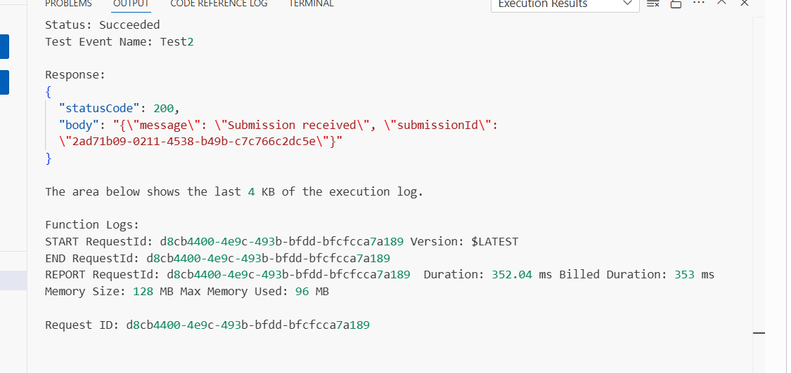
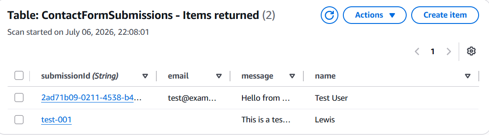

# Component 5 — Scoping IAM Permissions & Lambda Integration

## Objective

The fifth component of this project extended the Lambda function by granting it the minimum permissions required to write data into DynamoDB.

Rather than granting broad access, an inline IAM policy was attached to the Lambda execution role allowing only a single action against a single resource.

The placeholder Lambda code was then replaced with the application's first real business logic, allowing contact form submissions to be validated and stored inside DynamoDB.

---

# AWS Services Used

- AWS Lambda
- AWS Identity and Access Management (IAM)
- Amazon DynamoDB
- Amazon CloudWatch Logs

---

# What Was Created

An inline IAM policy named:

```text
contactForm-dynamodb-write
```

was attached to the Lambda execution role.

The policy grants only:

```text
dynamodb:PutItem
```

against the specific DynamoDB table:

```text
ContactFormSubmissions
```

No read, update or delete permissions were granted.

The default Lambda code was then replaced with a Python handler capable of:

- parsing the incoming request
- validating user input
- generating a UUID
- writing a new item into DynamoDB
- returning appropriate HTTP responses
- safely handling unexpected errors

---

# Why an Inline IAM Policy?

An inline IAM policy was chosen deliberately.

Unlike managed policies, inline policies belong exclusively to a single IAM role.

This permission set exists solely for the `contactFormHandler` Lambda function and has no reuse elsewhere.

If the execution role is deleted, the inline policy is automatically removed with it.

Using a managed policy here would simply introduce another IAM object without providing any practical benefit.

---

# Why Only `dynamodb:PutItem`?

The Lambda function currently only needs to create new submissions.

It does not need permission to:

- read items
- update items
- delete items
- scan the table

Granting only the permissions required follows the Principle of Least Privilege.

Instead of giving Lambda full DynamoDB access, only a single action on a single resource was authorised.

---

# Lambda Handler Logic

The boilerplate Lambda function was replaced with Python code that performs the following steps:

1. Parse the request body.
2. Extract the submitted name, email and message.
3. Validate that all required fields are present.
4. Generate a unique UUID for the submission.
5. Write the submission into DynamoDB.
6. Return a success response containing the submission ID.

If validation fails, the function immediately returns:

```text
HTTP 400
```

If an unexpected exception occurs, the function:

- logs the real exception to CloudWatch
- returns a generic

```text
HTTP 500
```

response to the client.

---

# Why Parse `event["body"]`?

Although API Gateway had not yet been created, the Lambda function was intentionally written to match API Gateway's proxy integration format.

API Gateway sends the request body as a JSON-encoded string inside:

```python
event["body"]
```

Using:

```python
json.loads(event.get("body", "{}"))
```

allows the function to convert that string into a Python dictionary before processing it.

Writing the handler this way avoids needing to rewrite the code once API Gateway is introduced later in the project.

---

# Input Validation

Validation occurs before attempting any database operation.

If any required field is missing:

- name
- email
- message

the function immediately returns:

```text
400 Bad Request
```

This avoids wasting unnecessary DynamoDB write operations on invalid data.

---

# Secure Error Handling

Unexpected exceptions are caught using a `try/except` block.

The real exception is written to CloudWatch Logs using:

```python
print(...)
```

while the client only receives:

```text
Internal server error
```

This prevents sensitive implementation details such as:

- table names
- stack traces
- code structure

from being exposed through the API.

---

# Verification

A test event containing valid contact form data was executed from the Lambda console.

The function successfully returned:

```text
HTTP 200
```

along with a newly generated submission ID.

This confirmed that:

- the Lambda code executed correctly
- the execution role had permission to perform `PutItem`
- the DynamoDB write completed successfully

The DynamoDB table was then opened and the newly created submission appeared successfully under **Explore table items**, proving the write operation had completed.

A successful write is itself evidence that the IAM policy was correctly configured.

Had the IAM permissions been incorrect, DynamoDB would have returned an `AccessDeniedException`, which the Lambda function would have caught and returned as a `500 Internal Server Error` instead.

---

# Screenshots

## Successful Lambda Execution

The updated Lambda function successfully processed a valid request and returned a `200 OK` response containing the generated submission ID.



---

## DynamoDB Item Successfully Written

The newly generated submission was successfully stored inside the `ContactFormSubmissions` table, confirming that the scoped IAM permissions allowed the Lambda function to write data correctly.



---

# Security Considerations

The Lambda execution role remained tightly scoped.

Only the following DynamoDB permission was granted:

```text
dynamodb:PutItem
```

against one specific table.

The function still had no permission to:

- Scan the table
- Read items
- Delete items
- Update items

Unexpected exceptions are logged only within CloudWatch and never exposed to API callers.

---

# Key Design Decisions

| Decision | Reason |
|----------|--------|
| Inline IAM policy | Permission exists for one role only |
| `dynamodb:PutItem` only | Follows the Principle of Least Privilege |
| Validate before writing | Prevents unnecessary database writes |
| UUID generation | Ensures every submission is stored independently |
| Generic error responses | Prevents leaking internal implementation details |
| CloudWatch logging | Provides diagnostics without exposing information to users |

---

# Lessons Learned

During this component I learned:

- IAM permissions should be granted one action at a time.
- Inline policies are appropriate when permissions belong to a single role.
- API Gateway sends request bodies as JSON strings inside `event["body"]`.
- Input validation should occur before any database operation.
- `PutItem` creates a new DynamoDB item when provided with a unique partition key.
- Successful DynamoDB writes confirm both the application logic and IAM permissions are functioning correctly.
- CloudWatch should contain detailed errors while clients receive only generic error messages.
- Least privilege is achieved by granting only the permissions required for the current functionality.
