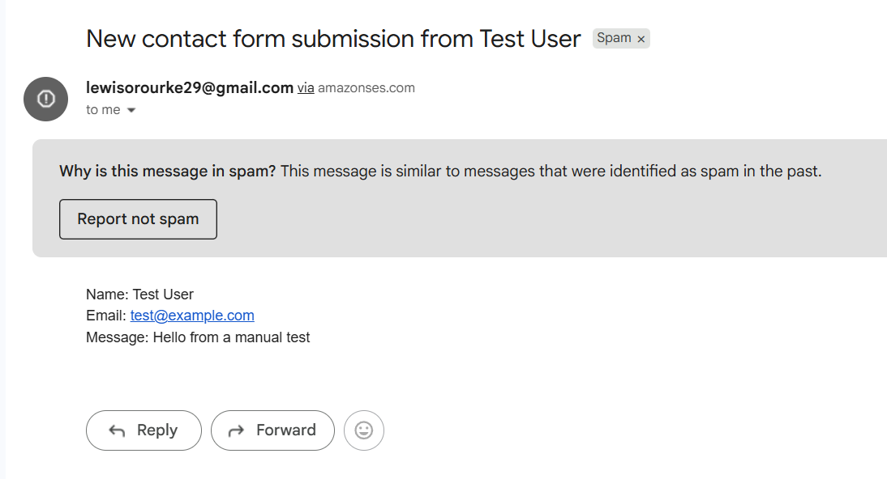

# Component 6 — Amazon SES Email Notifications

## Objective

The sixth component of this project introduced email notifications using Amazon Simple Email Service (SES).

After a successful DynamoDB write, the Lambda function now sends an email notification containing the submitted contact form details.

This allows new submissions to become immediately visible without manually checking the DynamoDB table.

---

# AWS Services Used

- Amazon SES
- AWS Lambda
- AWS Identity and Access Management (IAM)
- Amazon CloudWatch Logs

---

# What Was Created

An Amazon SES email identity was created by verifying my personal email address.

Because new AWS accounts operate in SES Sandbox Mode, the same verified email address was used as both:

- Source (sender)
- Destination (recipient)

An additional inline IAM policy was then attached to the Lambda execution role granting:

```text
ses:SendEmail
```

against the verified SES identity only.

Finally, the Lambda function was updated so that every successful DynamoDB write also attempts to send an email notification.

---

# Why Amazon SES?

Without notifications, every submission would silently be stored inside DynamoDB.

The only way to discover new submissions would be manually checking the database.

Amazon SES closes that feedback loop by automatically notifying the site owner whenever a new submission is received.

---

# Understanding SES Sandbox Mode

Every new AWS account begins in SES Sandbox Mode.

In sandbox mode, Amazon SES will only send emails:

- from verified identities
- to verified identities

Any attempt to send mail to an unverified address results in:

```text
MessageRejected
```

This restriction exists to protect Amazon's shared email infrastructure from abuse.

Without sandbox mode, attackers could create brand-new AWS accounts and immediately begin sending spam through Amazon SES, damaging the reputation of AWS's shared mail servers.

Moving an account into production requires submitting an AWS Support request for production access.

For this portfolio project, remaining in sandbox mode is perfectly acceptable because the notifications only need to reach my own verified email address.

---

# IAM Permission

A new inline IAM policy was attached to the Lambda execution role granting only:

```text
ses:SendEmail
```

against my verified SES identity.

No additional SES permissions were granted.

This continues following the Principle of Least Privilege established throughout the project.

---

# Lambda Design Decision

The email notification is intentionally separated from the DynamoDB write.

After the submission is successfully stored, the SES call executes inside its own nested `try/except` block.

This prevents notification failures from affecting the main submission.

For example, if:

- SES is temporarily unavailable
- sandbox restrictions are triggered
- email delivery fails

the contact form submission is still safely stored inside DynamoDB.

The notification failure is written to CloudWatch Logs while the user still receives a successful response.

This ensures the application's primary responsibility—saving user submissions—is never undone by a secondary feature.

---

# Why Separate Error Handling?

Sending an email is considered a side effect rather than the primary objective.

The primary contract with the user is:

```text
Your submission has been saved.
```

not

```text
An email notification was delivered.
```

If both operations shared the same exception handler, a failed email could incorrectly return an HTTP 500 response even though the submission had already been successfully stored.

Separating the two operations produces a more resilient application.

---

# Verification

A successful Lambda execution triggered an SES email notification.

The notification arrived in Gmail containing:

- submitted name
- submitted email address
- submitted message

The email header displayed:

```text
via amazonses.com
```

confirming that the message had been delivered through Amazon SES rather than being generated locally.

The successful delivery also proved:

- the Lambda execution role possessed the required `ses:SendEmail` permission
- the verified SES identity was configured correctly
- sandbox requirements had been satisfied

---

# Deliverability Limitation

Although the notification was successfully accepted and delivered by Amazon SES, Gmail classified the email as Spam.

This is an expected limitation rather than a configuration error.

Only an email address identity was verified.

No custom domain, SPF records or DKIM records were configured.

Without authenticated domain ownership or established sender reputation, Gmail treats messages sent through AWS's shared infrastructure as potentially suspicious.

In a production deployment, this would be addressed by:

- verifying a custom domain
- enabling DKIM
- publishing SPF records
- building sender reputation over time

Deliverability and successful API execution are separate concerns.

The API functioned correctly even though Gmail filtered the message.

---

# Screenshots

## SES Notification Successfully Received

After a successful Lambda execution, Amazon SES delivered an email notification containing the submitted contact form details.

The email header shows it was sent **via amazonses.com**, confirming that the message was processed through Amazon SES.



---

# Security Considerations

The Lambda execution role received only:

```text
ses:SendEmail
```

for the verified SES identity.

No broader SES permissions were granted.

Real exceptions remain visible only within CloudWatch Logs.

Users never receive internal exception messages or AWS implementation details.

---

# Key Design Decisions

| Decision | Reason |
|----------|--------|
| Verified personal email identity | Satisfies SES sandbox restrictions |
| Inline IAM policy | Permission exists only for this Lambda role |
| `ses:SendEmail` only | Follows least privilege |
| Separate `try/except` block | Prevents notification failures from affecting successful submissions |
| Generic client responses | Prevents leaking internal implementation details |
| Document spam delivery | Demonstrates understanding of production email deliverability |

---

# Lessons Learned

During this component I learned:

- Amazon SES begins in Sandbox Mode by default.
- Both sender and recipient must be verified while in sandbox mode.
- `MessageRejected` is returned when sandbox requirements are not satisfied.
- IAM permissions should be scoped to the minimum required actions.
- Email notifications should be treated independently from database writes.
- A successful SES API call does not guarantee inbox delivery.
- SPF, DKIM and sender reputation significantly affect email deliverability.
- Deliverability and application correctness are two separate engineering concerns.
