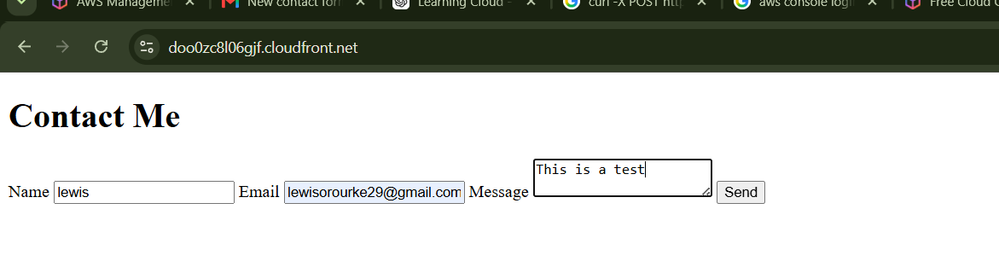
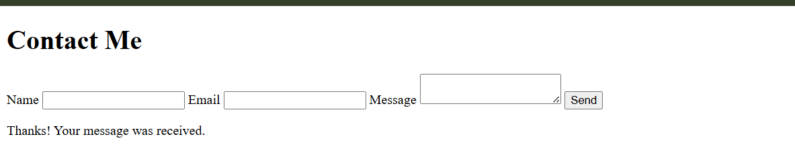
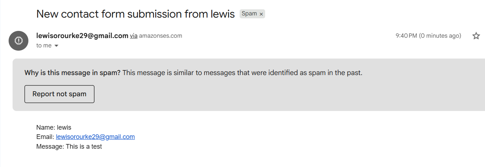
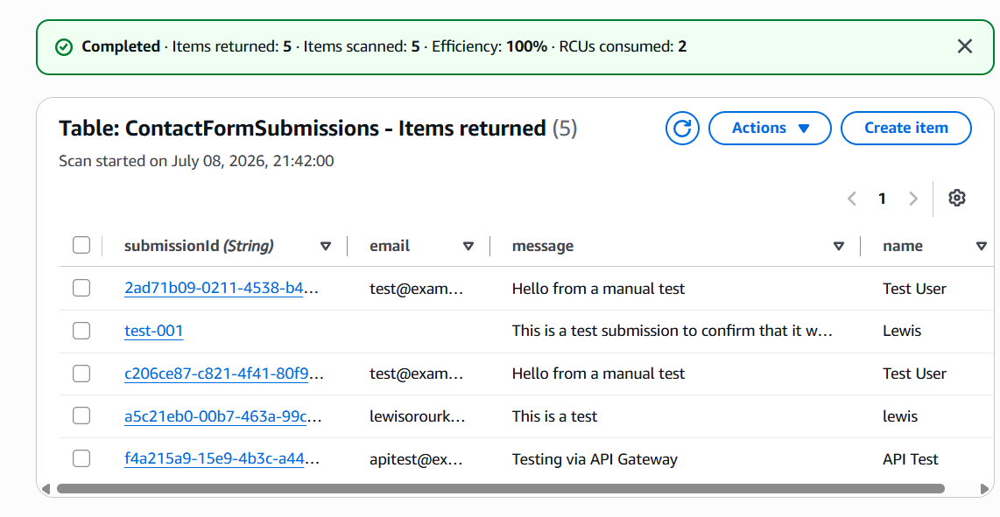

## Objective

The final component of this project was to connect the static website hosted on Amazon S3 and CloudFront to the live API Gateway endpoint.

This transformed the project from individually tested AWS services into a fully functional serverless web application where users can submit a contact form directly from their browser.

---

# AWS Services Used

- Amazon S3
- Amazon CloudFront
- Amazon API Gateway
- AWS Lambda
- Amazon DynamoDB
- Amazon SES

---

# What Was Created

The original placeholder `index.html` file was replaced with a fully functional contact form.

The page collects:

- Name
- Email
- Message

When the **Send** button is clicked, JavaScript serialises the form into JSON and sends it to the live API Gateway endpoint using an HTTPS POST request.

```text
CloudFront Website
        │
        ▼
JavaScript fetch()
        │
        ▼
API Gateway
        │
        ▼
Lambda
        │
 ┌──────┴──────┐
 ▼             ▼
DynamoDB      SES
```

---

# Why Replace the Original Page?

The original page simply proved that CloudFront could successfully serve static files.

This component converts the static website into a real frontend capable of interacting with the backend infrastructure that has been built throughout the previous components.

Rather than testing with Lambda console events or `curl`, users can now submit requests directly from their web browser.

---

# Frontend Implementation

The placeholder page was replaced with a new `index.html` containing:

- HTML contact form
- JavaScript form validation
- Fetch API POST request
- Success and error handling
- Automatic form reset after successful submission

The JavaScript submits requests directly to:

```text
https://3rxwrsc561.execute-api.us-east-1.amazonaws.com/contact
```

using:

```javascript
fetch(API_URL,{
    method:"POST",
    headers:{
        "Content-Type":"application/json"
    },
    body:JSON.stringify(payload)
})
```

This sends the contact form as JSON to API Gateway.

---

# Deploying the Updated Website

After replacing the local `index.html`, the new version was uploaded to the existing S3 bucket, replacing the previous file.

Because CloudFront caches static content, simply replacing the file inside S3 is not enough.

A CloudFront invalidation was created for:

```text
/index.html
```

(or alternatively `/*`)

This forced CloudFront to discard its cached version and retrieve the updated page from the S3 origin.

Without the invalidation, visitors would continue seeing the previous cached webpage.

---

# Verification

The completed CloudFront website was opened using the distribution domain.

A test submission was made through the browser.

The page displayed:

```text
Thanks!
Your message was received.
```

confirming the frontend successfully communicated with the backend.

The submission was then verified inside DynamoDB, where a brand new item appeared with a unique UUID.

Finally, Amazon SES successfully delivered the notification email containing the submitted details.

This confirmed the complete end-to-end workflow was functioning correctly.

---

# End-to-End Workflow

The completed application now follows this flow:

```text
User Browser
      │
      ▼
CloudFront
      │
      ▼
Static Website (HTML + JavaScript)
      │
      ▼
API Gateway
      │
      ▼
Lambda Function
      │
 ┌────┴────┐
 ▼         ▼
DynamoDB   SES
      │
      ▼
Submission Stored + Email Notification Sent
```

---

# Screenshots

## Live Contact Form

The completed CloudFront website displaying the functional contact form before submission.



---

## Successful Submission

After submitting the form, the frontend displayed a confirmation message indicating the request had been processed successfully.



---

## Email Notification Received

Amazon SES successfully delivered the notification email containing the submitted contact form details.



---

## DynamoDB Record Created

The submitted form was successfully written into the DynamoDB table with a newly generated UUID.



---

# Security Considerations

Several security controls remain in effect throughout the completed application:

- The S3 bucket remains private and is only accessible through CloudFront.
- API Gateway only accepts HTTPS requests.
- Lambda retains least-privilege IAM permissions.
- Input validation occurs before any DynamoDB write.
- Internal exceptions are logged to CloudWatch while generic errors are returned to users.
- Email notifications are sent only through the verified SES identity.

---

# Key Design Decisions

| Decision | Reason |
|----------|--------|
| Static frontend hosted on S3 | Low-cost, highly available static hosting |
| CloudFront distribution | HTTPS, caching and secure access to S3 |
| JavaScript Fetch API | Simple browser communication with API Gateway |
| CloudFront invalidation | Ensures updated content is served immediately |
| End-to-end browser testing | Confirms the complete application works outside the AWS console |

---

# Lessons Learned

During this component I learned:

- Static websites can directly communicate with serverless APIs using JavaScript.
- The Fetch API can send JSON payloads to API Gateway over HTTPS.
- CloudFront caches static content and requires invalidations when files change.
- Browser testing validates the complete application rather than individual AWS services.
- The application now performs a full end-to-end workflow from browser to DynamoDB and SES.
- Successfully connecting independent AWS services together creates a complete serverless application suitable for real-world deployment.
